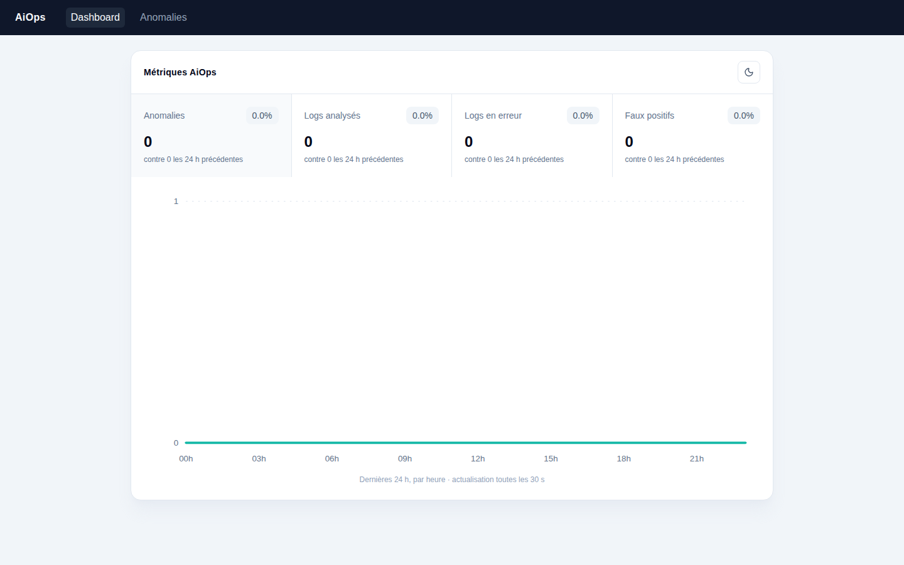
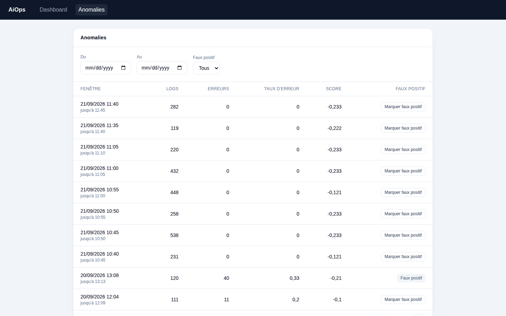
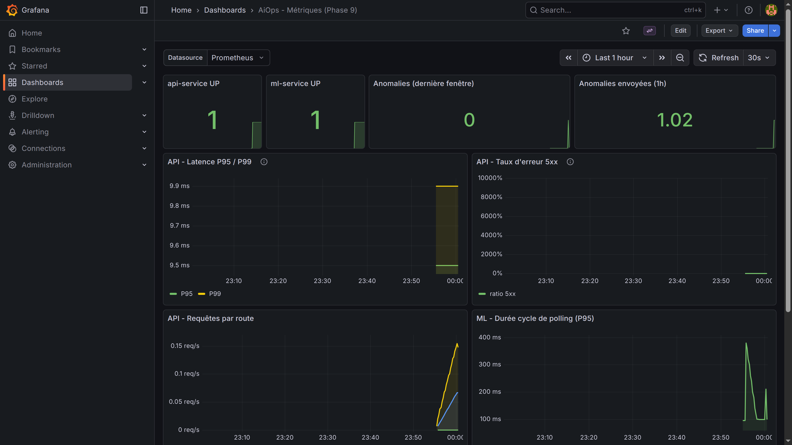
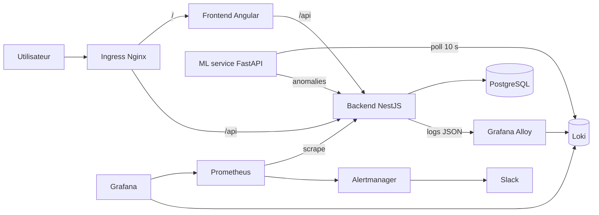

# AiOps

[](https://github.com/AbdelKarim-Ensi/AiOps/actions/workflows/backend-ci.yml)
[](https://github.com/AbdelKarim-Ensi/AiOps/actions/workflows/frontend-ci.yml)
[](https://github.com/AbdelKarim-Ensi/AiOps/actions/workflows/ml-service-ci.yml)


Plateforme d'observabilité avec détection d'anomalies sur les logs, déployée sur Kubernetes (kind) et entièrement reproductible : les logs JSON de l'API NestJS sont collectés par Grafana Alloy, stockés dans Loki, analysés toutes les 10 secondes par un service ML (Isolation Forest sur des fenêtres de 5 minutes), puis affichés dans un dashboard Angular. Prometheus, Grafana et Alertmanager (notifications Slack) complètent la boucle.

Projet d'apprentissage DevOps piloté par un [PRD](docs/PRD.pdf), avancé phase par phase avec une Definition of Done stricte.

## Aperçu

| Dashboard | Anomalies | Grafana |
|---|---|---|
|  |  |  |

## Architecture



## Stack technique

| Couche | Technologies |
|---|---|
| Backend | NestJS, Prisma, PostgreSQL, logs JSON structurés |
| Collecte de logs | Grafana Alloy → Loki |
| ML | FastAPI, scikit-learn (Isolation Forest), polling Loki toutes les 10 s, fenêtres de 5 min |
| Frontend | Angular (standalone components, signals), Tailwind, Lucide ; routes `/dashboard`, `/anomalies`, `/anomalies/:id` |
| Métriques et alertes | Prometheus (chart `prometheus-community/prometheus` v29.31.1), Grafana, Alertmanager, Slack |
| Infra | Docker (multi-stage), Kubernetes (kind), Terraform, Helm |
| CI/CD | GitHub Actions, runner self-hosted pour le déploiement |

## Structure du repo

```
.
├── apps/
│   ├── backend/          # API NestJS + Prisma
│   ├── frontend/         # Angular
│   └── ml-service/       # FastAPI + scikit-learn
├── infra/
│   ├── terraform/
│   │   ├── environments/local/
│   │   └── modules/kind-cluster/   # main.tf, variables.tf, outputs.tf
│   └── k8s/
│       ├── base/                   # api, postgres, ml-service, frontend, ingress
│       └── observability/          # loki, grafana-alloy, grafana (+ dashboards),
│                                   # prometheus, alertmanager, install.sh
├── docs/architecture/    # documentation détaillée par phase
├── docker-compose.yml    # lancement local de l'API et de PostgreSQL (phase 2)
└── .github/workflows/    # CI/CD par service
```

## Prérequis

Versions utilisées pendant le développement :

| Outil | Version |
|---|---|
| Docker Desktop | 29.7.2 |
| kind | 0.24.0 |
| kubectl | 1.37.0 |
| Terraform | 1.9.5 (provider `tehcyx/kind`) |
| Helm | 3.22.0 |
| Node.js | 24.21.0 en local ; 20 (backend) et 22 (frontend) dans la CI |
| Python | 3.12.3 (build local) |

Il faut aussi :

- un runner GitHub Actions self-hosted actif sur la machine (voir plus bas) ;
- un webhook Slack entrant pour les alertes ;
- un PAT GitHub avec les scopes `repo` **et** `workflow` (sinon les push vers `.github/workflows/` sont refusés).

## Déploiement de zéro

> Avant tout : `kind get clusters`. Si un ancien cluster traîne, supprime-le (`kind delete cluster --name <nom>`). Deux clusters kind simultanés cassent la résolution DNS et bloquent les pulls d'images.

### 1. Cluster (Terraform)

```bash
cd infra/terraform/modules/kind-cluster
terraform init
terraform apply
```

Terraform crée uniquement le cluster kind `aiops-cluster-tf` (provider `tehcyx/kind`). Tout le reste est déployé avec `kubectl` et `helm`.

### 2. Ingress Nginx et namespaces

```bash
kubectl apply -f https://raw.githubusercontent.com/kubernetes/ingress-nginx/controller-v1.12.1/deploy/static/provider/kind/deploy.yaml
kubectl wait -n ingress-nginx --for=condition=ready pod -l app.kubernetes.io/component=controller --timeout=180s

kubectl create namespace aiops --dry-run=client -o yaml | kubectl apply -f -
kubectl create namespace observability --dry-run=client -o yaml | kubectl apply -f -
```

### 3. Secrets (créés à la main, jamais versionnés)

| Secret | Namespace | Rôle |
|---|---|---|
| `postgres-secret` | `aiops` | Clés `DATABASE_URL` et `POSTGRES_PASSWORD` |
| `api-secret` | `aiops` | Clé `DATABASE_URL` (utilisée par Prisma) |
| `alertmanager-slack-webhook` | `observability` | Clé `webhook_url` |

```bash
kubectl create secret generic postgres-secret -n aiops \
  --from-literal=POSTGRES_PASSWORD='<MOT_DE_PASSE>' \
  --from-literal=DATABASE_URL='postgresql://postgres:<MOT_DE_PASSE>@postgres-service.aiops.svc.cluster.local:5432/taskmanager'

kubectl create secret generic api-secret -n aiops \
  --from-literal=DATABASE_URL='postgresql://postgres:<MOT_DE_PASSE>@postgres-service.aiops.svc.cluster.local:5432/taskmanager'

kubectl create secret generic alertmanager-slack-webhook -n observability \
  --from-literal=webhook_url='<URL_WEBHOOK_SLACK>'
```

`postgres-service` est le Service headless de PostgreSQL dans le namespace `aiops`. Le mot de passe doit être identique dans les trois valeurs.

Le Secret `grafana` (identifiants admin) est généré par le chart Helm.

### 4. Base de données et backend

```bash
kubectl apply -f infra/k8s/base/postgres/
kubectl rollout status statefulset/postgres -n aiops --timeout=300s
kubectl apply -f infra/k8s/base/api/
kubectl rollout status deployment/api -n aiops --timeout=300s
```

Le ConfigMap `postgres-config` fixe `POSTGRES_DB=taskmanager` et `POSTGRES_USER=postgres`. L'image du backend vient de `ghcr.io/abdelkarim-ensi/aiops-backend:latest`.

### 5. Observabilité (Loki, Alloy, Grafana)

```bash
./infra/k8s/observability/install.sh
```

Le script fait `helm upgrade --install` de `loki`, `alloy` et `grafana` (repo `grafana/*`). Les dashboards Grafana sont dans `infra/k8s/observability/grafana/dashboards` (voir `docs/architecture/phase-9-prometheus-grafana.md`).

### 6. Service ML

Le manifest référence l'image locale `aiops-ml-service:dev` : pour l'installation initiale, construis-la et charge-la dans le cluster. Ensuite, la CI publie l'image sur GHCR et met à jour le Deployment avec le tag SHA du commit, sans nouveau `kind load`.

```bash
docker build -t aiops-ml-service:dev apps/ml-service
kind load docker-image aiops-ml-service:dev --name aiops-cluster-tf
kubectl apply -f infra/k8s/base/ml-service/
```

Configuration via le ConfigMap `ml-service-config` :

| Variable | Valeur |
|---|---|
| `LOKI_URL` | `http://loki.observability.svc.cluster.local:3100` |
| `LOKI_TENANT_ID` | `aiops` |
| `LOKI_QUERY` | `{namespace="aiops", container="api"}` |
| `BACKEND_URL` | `http://api-service.aiops.svc.cluster.local:3000` |

### 7. Prometheus et Alertmanager (manuel, hors CI)

Le Secret `alertmanager-slack-webhook` (étape 3) doit exister avant l'installation : Alertmanager le monte pour lire l'URL du webhook.

```bash
helm repo add prometheus-community https://prometheus-community.github.io/helm-charts
helm repo update

cd infra/k8s/observability/prometheus
helm upgrade --install prometheus prometheus-community/prometheus -n observability \
  --version 29.31.1 \
  -f values-prometheus.yaml -f values-alertmanager.yaml
```

Ce chart n'est pas `kube-prometheus-stack` : il n'y a pas de CRD `PrometheusRule`, les règles d'alerte sont dans les values (`serverFiles.alerting_rules.yml`). La règle `AnomalyScoreHigh` se déclenche quand `ml_anomaly_score_latest > 0.7` (sévérité `critical`) et notifie Slack. Détails : `docs/architecture/phase-9-prometheus-grafana.md` et `docs/architecture/phase-11-alerting.md`. Ce déploiement ne passe pas par la CI.

### 8. Frontend et Ingress

```bash
kubectl apply -f infra/k8s/base/frontend/
kubectl apply -f infra/k8s/base/ingress/
```

Deux objets Ingress coexistent sur le host `localhost` : `/` vers `frontend-service` et `/api` vers `api-service`, avec réécriture du préfixe uniquement pour `/api`. L'annotation `rewrite-target` s'applique à tout un objet Ingress, d'où la séparation ; ingress-nginx fusionne les deux (voir `docs/architecture/phase-10-frontend-dashboard.md`).

### 9. Vérification

```bash
kubectl get pods -A
curl -I http://localhost/
```

Tous les pods des namespaces `aiops`, `observability` et `ingress-nginx` doivent être `Running` / `Ready`.

## Accès

| Service | URL |
|---|---|
| Dashboard | http://localhost/dashboard |
| Anomalies | http://localhost/anomalies |
| API | http://localhost/api |
| Grafana | `kubectl port-forward -n observability svc/grafana 3000:80` → http://localhost:3000 |
| Prometheus | `kubectl port-forward -n observability svc/prometheus-server 9090:80` → http://localhost:9090 |

## CI/CD

Un workflow par service (`backend`, `frontend`, `ml-service`) dans `.github/workflows/`, sur le schéma `lint/build/test → docker-build-push → deploy`.

- Les images sont poussées sur GHCR avec deux tags : `latest` et le SHA du commit.
- Le job `deploy` tourne sur un runner self-hosted : il fait `kubectl set image` (pour le backend, après avoir appliqué les migrations Prisma dans un pod éphémère) avec le **tag SHA**, ce qui rend chaque déploiement traçable et réversible (`kubectl rollout undo`). Le tag `latest` des manifests ne sert qu'à l'installation initiale.
- Secret GitHub requis : `DATABASE_URL` (utilisé pour la migration Prisma).

Le runner doit être lancé et rester actif, sinon les jobs `deploy` restent en attente :

```bash
cd ~/Projects/actions-runner && ./run.sh
```

## Documentation détaillée

- [Phase 1 : backend NestJS + Prisma](docs/architecture/phase-1-backend-nestjs-prisma.md)
- [Phase 2 : dockerisation](docs/architecture/phase-2-dockerisation.md)
- [Phase 3 : CI GitHub Actions](docs/architecture/phase-3-ci-github-actions.md)
- [Phase 4 : cluster kind et Terraform](docs/architecture/phase-4-kind-terraform.md)
- [Phase 5 : déploiement Kubernetes](docs/architecture/phase-5-k8s-deploy.md)
- [Phase 6 : observabilité](docs/architecture/phase-6-observability.md)
- [Phase 7 : service ML](docs/architecture/phase-7-ml-service.md)
- [Phase 8 : intégration ML / Loki](docs/architecture/phase-8-ml-loki-integration.md)
- [Phase 9 : Prometheus et Grafana](docs/architecture/phase-9-prometheus-grafana.md)
- [Phase 10 : dashboard frontend](docs/architecture/phase-10-frontend-dashboard.md)
- [Phase 11 : alerting](docs/architecture/phase-11-alerting.md)

## Dépannage

- **Erreurs DNS / pulls d'images bloqués** : vérifier `kind get clusters` et supprimer les clusters en double.
- **`kind load docker-image` échoue** (digest de manifest multi-plateforme) : faire un `crictl pull` directement dans le nœud une fois le DNS stable.
- **Tag PostgreSQL** : utiliser `postgres:15-alpine` (le tag `-amd64` n'existe pas).
- **Secret introuvable** : le nom du Secret doit être identique dans le manifest de Secret et dans le `secretRef` du Deployment.
- **`extraScrapeConfigs` sans effet** : la clé doit être à la racine du values Prometheus, pas sous `server:`.

## Limites connues

- Pas de LLM : la détection repose uniquement sur un Isolation Forest.
- Pas de multi-cloud : cluster local kind uniquement.
- Pas d'authentification OAuth.
- Seuil d'alerte fixé à **0.7** au lieu des 0.8 du PRD : 0.8 n'est jamais atteint sur l'échelle réelle du modèle (calibration détaillée dans la phase 11).
- Déploiement de l'observabilité et création des Secrets manuels, hors CI.
- Le manifest du service ML référence une image locale (`aiops-ml-service:dev`) pour l'installation initiale ; la CI de ce service ne fait qu'une vérification syntaxique (`py_compile`), sans tests unitaires.

## Contact

Abdel Karim Doudey, [@AbdelKarim-Ensi](https://github.com/AbdelKarim-Ensi)

Licence : [MIT](LICENSE)