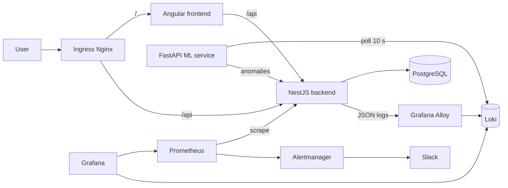

# AiOps

[](https://github.com/AbdelKarim-Ensi/AiOps/actions/workflows/backend-ci.yml)
[](https://github.com/AbdelKarim-Ensi/AiOps/actions/workflows/frontend-ci.yml)
[](https://github.com/AbdelKarim-Ensi/AiOps/actions/workflows/ml-service-ci.yml)


An observability platform with log anomaly detection, deployed on Kubernetes (kind) and fully reproducible: JSON logs from the NestJS API are collected by Grafana Alloy, stored in Loki, analysed every 10 seconds by an ML service (Isolation Forest on 5-minute windows), and displayed in an Angular dashboard. Prometheus, Grafana and Alertmanager (Slack notifications) close the loop.

A DevOps learning project driven by a [PRD](docs/PRD.pdf) and built phase by phase, each with a strict Definition of Done.

## Overview

| Dashboard | Anomalies | Grafana |
|---|---|---|
|  |  |  |

## Architecture



## Tech stack

| Layer | Technologies |
|---|---|
| Backend | NestJS, Prisma, PostgreSQL, structured JSON logs |
| Log collection | Grafana Alloy → Loki |
| ML | FastAPI, scikit-learn (Isolation Forest), Loki polling every 10 s, 5-minute windows |
| Frontend | Angular (standalone components, signals), Tailwind, Lucide; routes `/dashboard`, `/anomalies`, `/anomalies/:id` |
| Metrics and alerting | Prometheus (chart `prometheus-community/prometheus` v29.31.1), Grafana, Alertmanager, Slack |
| Infrastructure | Docker (multi-stage), Kubernetes (kind), Terraform, Helm |
| CI/CD | GitHub Actions, self-hosted runner for deployment |

## Repository structure

```
.
├── apps/
│   ├── backend/          # NestJS + Prisma API
│   ├── frontend/         # Angular
│   └── ml-service/       # FastAPI + scikit-learn
├── infra/
│   ├── terraform/
│   │   ├── environments/local/
│   │   └── modules/kind-cluster/   # main.tf, variables.tf, outputs.tf
│   └── k8s/
│       ├── base/                   # api, postgres, ml-service, frontend, ingress
│       └── observability/          # loki, grafana-alloy, grafana (+ dashboards),
│                                   # prometheus, alertmanager, install.sh
├── docs/architecture/    # detailed documentation per phase
├── docker-compose.yml    # local run of the API and PostgreSQL (phase 2)
└── .github/workflows/    # per-service CI/CD
```

## Prerequisites

Versions used during development:

| Tool | Version |
|---|---|
| Docker Desktop | 29.7.2 |
| kind | 0.24.0 |
| kubectl | 1.37.0 |
| Terraform | 1.9.5 (provider `tehcyx/kind`) |
| Helm | 3.22.0 |
| Node.js | 24.21.0 locally; 20 (backend) and 22 (frontend) in CI |
| Python | 3.12.3 (local build) |

You also need:

- an active self-hosted GitHub Actions runner on your machine (see below);
- an incoming Slack webhook for alerts;
- a GitHub PAT with both the `repo` **and** `workflow` scopes (otherwise pushes to `.github/workflows/` are rejected).

## Deploy from scratch

> Before anything else, run `kind get clusters`. If an old cluster is lying around, delete it (`kind delete cluster --name <name>`). Two kind clusters running at the same time break DNS resolution and block image pulls.

### 1. Cluster (Terraform)

```bash
cd infra/terraform/modules/kind-cluster
terraform init
terraform apply
```

Terraform only creates the kind cluster `aiops-cluster-tf` (provider `tehcyx/kind`). Everything else is deployed with `kubectl` and `helm`.

### 2. Ingress Nginx and namespaces

```bash
kubectl apply -f https://raw.githubusercontent.com/kubernetes/ingress-nginx/controller-v1.12.1/deploy/static/provider/kind/deploy.yaml
kubectl wait -n ingress-nginx --for=condition=ready pod -l app.kubernetes.io/component=controller --timeout=180s

kubectl create namespace aiops --dry-run=client -o yaml | kubectl apply -f -
kubectl create namespace observability --dry-run=client -o yaml | kubectl apply -f -
```

### 3. Secrets (created by hand, never committed)

| Secret | Namespace | Purpose |
|---|---|---|
| `postgres-secret` | `aiops` | Keys `DATABASE_URL` and `POSTGRES_PASSWORD` |
| `api-secret` | `aiops` | Key `DATABASE_URL` (used by Prisma) |
| `alertmanager-slack-webhook` | `observability` | Key `webhook_url` |

```bash
kubectl create secret generic postgres-secret -n aiops \
  --from-literal=POSTGRES_PASSWORD='<PASSWORD>' \
  --from-literal=DATABASE_URL='postgresql://postgres:<PASSWORD>@postgres-service.aiops.svc.cluster.local:5432/taskmanager'

kubectl create secret generic api-secret -n aiops \
  --from-literal=DATABASE_URL='postgresql://postgres:<PASSWORD>@postgres-service.aiops.svc.cluster.local:5432/taskmanager'

kubectl create secret generic alertmanager-slack-webhook -n observability \
  --from-literal=webhook_url='<SLACK_WEBHOOK_URL>'
```

`postgres-service` is the headless PostgreSQL Service in the `aiops` namespace. The password must be identical in all three values.

Templates are provided in `infra/k8s/base/postgres/secret.yaml.example` and `infra/k8s/base/api/secret.yaml.example`: you can copy them to `secret.yaml` (ignored by git), fill in the values and apply them instead of the commands above.

The `grafana` Secret (admin credentials) is generated by the Helm chart.

### 4. Database and backend

```bash
kubectl apply -f infra/k8s/base/postgres/
kubectl rollout status statefulset/postgres -n aiops --timeout=300s
kubectl apply -f infra/k8s/base/api/
kubectl rollout status deployment/api -n aiops --timeout=300s
```

The `postgres-config` ConfigMap sets `POSTGRES_DB=taskmanager` and `POSTGRES_USER=postgres`. The backend image comes from `ghcr.io/abdelkarim-ensi/aiops-backend:latest`.

### 5. Observability (Loki, Alloy, Grafana)

```bash
./infra/k8s/observability/install.sh
```

The script runs `helm upgrade --install` for `loki`, `alloy` and `grafana` (`grafana/*` repo). Grafana dashboards live in `infra/k8s/observability/grafana/dashboards` (see `docs/architecture/phase-9-prometheus-grafana.md`).

### 6. ML service

The manifest references the local image `aiops-ml-service:dev`: for the initial install, build it and load it into the cluster. Afterwards, CI publishes the image to GHCR and updates the Deployment with the commit SHA tag, with no further `kind load`.

```bash
docker build -t aiops-ml-service:dev apps/ml-service
kind load docker-image aiops-ml-service:dev --name aiops-cluster-tf
kubectl apply -f infra/k8s/base/ml-service/
```

Configuration comes from the `ml-service-config` ConfigMap:

| Variable | Value |
|---|---|
| `LOKI_URL` | `http://loki.observability.svc.cluster.local:3100` |
| `LOKI_TENANT_ID` | `aiops` |
| `LOKI_QUERY` | `{namespace="aiops", container="api"}` |
| `BACKEND_URL` | `http://api-service.aiops.svc.cluster.local:3000` |

### 7. Prometheus and Alertmanager (manual, outside CI)

The `alertmanager-slack-webhook` Secret (step 3) must exist before installing: Alertmanager mounts it to read the webhook URL.

```bash
helm repo add prometheus-community https://prometheus-community.github.io/helm-charts
helm repo update

cd infra/k8s/observability/prometheus
helm upgrade --install prometheus prometheus-community/prometheus -n observability \
  --version 29.31.1 \
  -f values-prometheus.yaml -f values-alertmanager.yaml
```

This chart is not `kube-prometheus-stack`: there is no `PrometheusRule` CRD, so alert rules live in the values (`serverFiles.alerting_rules.yml`). The `AnomalyScoreHigh` rule fires when `ml_anomaly_score_latest > 0.7` (severity `critical`) and notifies Slack. Details: `docs/architecture/phase-9-prometheus-grafana.md` and `docs/architecture/phase-11-alerting.md`. This deployment does not go through CI.

### 8. Frontend and Ingress

```bash
kubectl apply -f infra/k8s/base/frontend/
kubectl apply -f infra/k8s/base/ingress/
```

Two Ingress objects share the `localhost` host: `/` goes to `frontend-service` and `/api` to `api-service`, with prefix rewriting for `/api` only. The `rewrite-target` annotation applies to a whole Ingress object, hence the split; ingress-nginx merges the two (see `docs/architecture/phase-10-frontend-dashboard.md`).

### 9. Verification

```bash
kubectl get pods -A
curl -I http://localhost/
```

All pods in the `aiops`, `observability` and `ingress-nginx` namespaces must be `Running` / `Ready`.

## Access

| Service | URL |
|---|---|
| Dashboard | http://localhost/dashboard |
| Anomalies | http://localhost/anomalies |
| API | http://localhost/api |
| Grafana | `kubectl port-forward -n observability svc/grafana 3000:80` → http://localhost:3000 |
| Prometheus | `kubectl port-forward -n observability svc/prometheus-server 9090:80` → http://localhost:9090 |

## CI/CD

One workflow per service (`backend`, `frontend`, `ml-service`) in `.github/workflows/`, following the `lint/build/test → docker-build-push → deploy` pattern.

- Images are pushed to GHCR with two tags: `latest` and the commit SHA.
- The `deploy` job runs on a self-hosted runner: it runs `kubectl set image` (for the backend, after applying Prisma migrations in an ephemeral pod) with the **SHA tag**, which makes every deployment traceable and reversible (`kubectl rollout undo`). The `latest` tag in the manifests is only used for the initial install.
- Required GitHub secret: `DATABASE_URL` (used for the Prisma migration).

The runner must be started and stay active, otherwise `deploy` jobs stay queued:

```bash
cd ~/Projects/actions-runner && ./run.sh
```

## Detailed documentation Detailed documentation

- [Phase 1: NestJS + Prisma backend](docs/architecture/phase-1-backend-nestjs-prisma.md)
- [Phase 2: containerisation](docs/architecture/phase-2-dockerisation.md)
- [Phase 3: GitHub Actions CI](docs/architecture/phase-3-ci-github-actions.md)
- [Phase 4: kind cluster and Terraform](docs/architecture/phase-4-kind-terraform.md)
- [Phase 5: Kubernetes deployment](docs/architecture/phase-5-k8s-deploy.md)
- [Phase 6: observability](docs/architecture/phase-6-observability.md)
- [Phase 7: ML service](docs/architecture/phase-7-ml-service.md)
- [Phase 8: ML / Loki integration](docs/architecture/phase-8-ml-loki-integration.md)
- [Phase 9: Prometheus and Grafana](docs/architecture/phase-9-prometheus-grafana.md)
- [Phase 10: frontend dashboard](docs/architecture/phase-10-frontend-dashboard.md)
- [Phase 11: alerting](docs/architecture/phase-11-alerting.md)

## Troubleshooting

- **DNS errors / stuck image pulls**: check `kind get clusters` and delete duplicate clusters.
- **`kind load docker-image` fails** (multi-platform manifest digest): run `crictl pull` directly inside the node once DNS is stable.
- **PostgreSQL tag**: use `postgres:15-alpine` (the `-amd64` tag does not exist).
- **Secret not found**: the Secret name must be identical in the Secret manifest and in the Deployment's `secretRef`.
- **`extraScrapeConfigs` has no effect**: the key must be at the root of the Prometheus values, not under `server:`.

## Known limitations

- No LLM: detection relies solely on an Isolation Forest.
- No multi-cloud: local kind cluster only.
- No OAuth authentication.
- Alert threshold set to **0.7** instead of the PRD's 0.8: 0.8 is never reached on the model's actual score scale (calibration detailed in phase 11).
- Observability deployment and Secret creation are manual, outside CI.
- The ML service manifest references a local image (`aiops-ml-service:dev`) for the initial install; that service's CI only performs a syntax check (`py_compile`), with no unit tests.

## Contact

Abdel Karim Doudey, [@AbdelKarim-Ensi](https://github.com/AbdelKarim-Ensi)

License: [MIT](LICENSE)