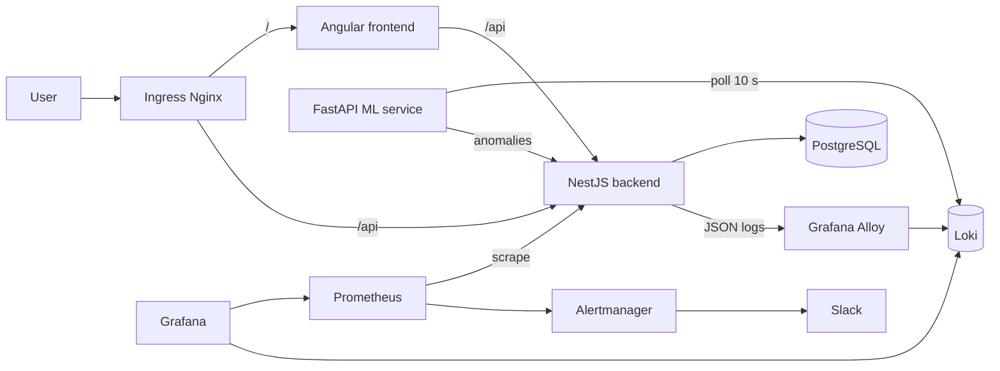

# AiOps

[](https://github.com/AbdelKarim-Ensi/AiOps/actions/workflows/backend-ci.yml)
[](https://github.com/AbdelKarim-Ensi/AiOps/actions/workflows/frontend-ci.yml)
[](https://github.com/AbdelKarim-Ensi/AiOps/actions/workflows/ml-service-ci.yml)


An observability platform with log anomaly detection, deployed on Kubernetes (kind) and fully reproducible: JSON logs from the NestJS API are collected by Grafana Alloy, stored in Loki, analysed every 10 seconds by an ML service (Isolation Forest on 5-minute windows), and displayed in an Angular dashboard. Prometheus, Grafana and Alertmanager (Slack notifications) close the loop.

A DevOps learning project driven by a [PRD](docs/PRD.pdf) and built phase by phase, each with a strict Definition of Done.

## Overview

| Dashboard | Anomalies | Grafana |
|---|---|---|
|  |  |  |

## Architecture




## Quick start (run it locally)

This section is a standalone, copy-pasteable path from a clean clone to a working dashboard. For deeper explanations of each step, see [Deploy from scratch](#deploy-from-scratch) and `docs/architecture/`.

### 1. Prerequisites

Versions used during development (see [Prerequisites](#prerequisites) below for the full list):

| Tool | Version |
|---|---|
| Docker Desktop | 29.7.2 |
| kind | 0.24.0 |
| kubectl | 1.37.0 |
| Terraform | 1.9.5 (provider `tehcyx/kind`) |
| Helm | 3.22.0 |

> **Resources:** not benchmarked precisely in this repo, but the cluster runs Postgres, the API, the ML service, the frontend, Loki, Alloy, Grafana, Prometheus and Alertmanager on a single kind node at once. Give Docker Desktop's VM **at least 4 CPUs / 8 GB RAM**; less than that has been a source of stuck pulls and OOM-killed pods in practice. Treat this as a starting point, not a hard number from the project's docs.

You do **not** need Node.js or Python installed just to run the demo — the backend and frontend images are pulled from GHCR. You only need them if you want to build images locally (see step 4, option B).

### 2. Clone the repo

```bash
git clone https://github.com/AbdelKarim-Ensi/AiOps.git
cd AiOps
```

### 3. Create the kind cluster (Terraform)

```bash
kind get clusters
```

If anything is listed, delete it first — running two kind clusters at once breaks DNS resolution and blocks image pulls (see `docs/architecture/phase-4-kind-terraform.md` and `phase-5-k8s-deploy.md`):

```bash
kind delete cluster --name <old-cluster-name>
```

Then create the cluster:

```bash
cd infra/terraform/modules/kind-cluster
terraform init
terraform apply
cd ../../../..
```

This creates the kind cluster `aiops-cluster-tf` only (provider `tehcyx/kind`). Everything else below is `kubectl`/`helm`.

### 4. Get the container images into the cluster

**Option A — easiest, recommended for a first run.** The backend and frontend Deployments already reference `ghcr.io/abdelkarim-ensi/aiops-backend:latest` and `ghcr.io/abdelkarim-ensi/aiops-frontend:latest` with no `imagePullPolicy` override — since the tag is `latest`, Kubernetes defaults that to `Always`, so the kind node pulls both images from GHCR automatically the first time you `kubectl apply` them in step 5. **You don't need to build anything for these two.**

The ML service is the one exception: its manifest points at a local-only tag, `aiops-ml-service:dev` (`imagePullPolicy: IfNotPresent`), because CI does build and push it to GHCR but the manifest was never switched over (see `docs/architecture/phase-11-alerting.md`, "Known limitations"). For the initial install you must build and load it yourself:

```bash
docker build -t aiops-ml-service:dev apps/ml-service
kind load docker-image aiops-ml-service:dev --name aiops-cluster-tf
```

**Option B — fully local build (no GHCR pull), useful if you want to test your own changes or have no internet access from the cluster.** Build and load all three images the same way:

```bash
docker build -t aiops-backend:dev apps/backend
docker build -t aiops-frontend:dev apps/frontend
docker build -t aiops-ml-service:dev apps/ml-service

kind load docker-image aiops-backend:dev --name aiops-cluster-tf
kind load docker-image aiops-frontend:dev --name aiops-cluster-tf
kind load docker-image aiops-ml-service:dev --name aiops-cluster-tf
```

Note: this repo's manifests are not parameterized for local tags, so for the backend and frontend you'd need to edit `infra/k8s/base/api/deployment.yaml` and `infra/k8s/base/frontend/deployment.yaml` yourself (change `image:` to `aiops-backend:dev` / `aiops-frontend:dev` and set `imagePullPolicy: IfNotPresent`) before applying them in step 5. This isn't scripted anywhere in the repo — option A is the path that works out of the box.

### 5. Ingress controller, namespaces, and Secrets

Install the ingress-nginx controller (kind's own manifest) and wait for it to be ready:

```bash
kubectl apply -f https://raw.githubusercontent.com/kubernetes/ingress-nginx/controller-v1.12.1/deploy/static/provider/kind/deploy.yaml
kubectl wait -n ingress-nginx --for=condition=ready pod -l app.kubernetes.io/component=controller --timeout=180s
```

Create the namespaces:

```bash
kubectl create namespace aiops --dry-run=client -o yaml | kubectl apply -f -
kubectl create namespace observability --dry-run=client -o yaml | kubectl apply -f -
```

Create the Secrets by hand — **never commit real values**:

| Secret | Namespace | Keys |
|---|---|---|
| `postgres-secret` | `aiops` | `POSTGRES_PASSWORD`, `DATABASE_URL` |
| `api-secret` | `aiops` | `DATABASE_URL` |
| `alertmanager-slack-webhook` | `observability` | `webhook_url` |

```bash
kubectl create secret generic postgres-secret -n aiops \
  --from-literal=POSTGRES_PASSWORD='<your-postgres-password>' \
  --from-literal=DATABASE_URL='postgresql://postgres:<your-postgres-password>@postgres-service.aiops.svc.cluster.local:5432/taskmanager'

kubectl create secret generic api-secret -n aiops \
  --from-literal=DATABASE_URL='postgresql://postgres:<your-postgres-password>@postgres-service.aiops.svc.cluster.local:5432/taskmanager'
```

The password must be identical in all three `DATABASE_URL`/`POSTGRES_PASSWORD` values above. Templates are also available at `infra/k8s/base/postgres/secret.yaml.example` and `infra/k8s/base/api/secret.yaml.example` if you'd rather copy them to `secret.yaml` (git-ignored), fill in the values, and `kubectl apply -f` them instead.

For `alertmanager-slack-webhook`, see the "Slack alerting is optional" note at the end of this section before creating it.

### 6. Database, backend, ML service, frontend, and Ingress

```bash
kubectl apply -f infra/k8s/base/postgres/
kubectl rollout status statefulset/postgres -n aiops --timeout=300s

kubectl apply -f infra/k8s/base/api/
kubectl rollout status deployment/api -n aiops --timeout=300s
```

### 7. Observability stack (Loki, Alloy, Grafana)

```bash
chmod +x infra/k8s/observability/install.sh
./infra/k8s/observability/install.sh
```

This installs Loki (`grafana/loki` v7.3.0), Grafana Alloy, and Grafana in that order via `helm upgrade --install`.

Now apply the ML service (image was built/loaded in step 4):

```bash
kubectl apply -f infra/k8s/base/ml-service/
```

Install Prometheus + Alertmanager:

```bash
helm repo add prometheus-community https://prometheus-community.github.io/helm-charts
helm repo update

cd infra/k8s/observability/prometheus
helm upgrade --install prometheus prometheus-community/prometheus -n observability \
  --version 29.31.1 \
  -f values-prometheus.yaml -f values-alertmanager.yaml
cd ../../../..
```

> If you have no Slack webhook, drop `-f values-alertmanager.yaml` from this command — see the note at the end of this section.

Load the Grafana dashboard (the sidecar auto-discovers ConfigMaps labelled `grafana_dashboard=1`):

```bash
kubectl create configmap aiops-metrics-dashboard -n observability \
  --from-file=aiops-metrics.json=infra/k8s/observability/grafana/dashboards/aiops-metrics.json \
  --dry-run=client -o yaml | kubectl apply -f -
kubectl label configmap aiops-metrics-dashboard -n observability grafana_dashboard=1 --overwrite
```

Finally, the frontend and the Ingress rules:

```bash
kubectl apply -f infra/k8s/base/frontend/
kubectl apply -f infra/k8s/base/ingress/
```

### 8. Verify everything is up

```bash
kubectl get pods -A
```

Expect every pod in the `aiops`, `observability`, and `ingress-nginx` namespaces to be `Running`/`Ready` (this can take a few minutes on the first run while images pull).

```bash
curl -I http://localhost/
curl -s http://localhost/api/health
curl -s http://localhost/api/anomalies/stats
```

Open the dashboard in a browser: **http://localhost/dashboard** (or **http://localhost/** — the frontend Ingress rule matches `/` and serves the Angular app; the anomaly list is at `/anomalies`).

Grafana:

```bash
kubectl -n observability port-forward svc/grafana 3001:80
```
→ http://localhost:3001 (`admin` / `admin` — see [Known limitations](#known-limitations))

Prometheus:

```bash
kubectl port-forward -n observability svc/prometheus-server 9090:80
```
→ http://localhost:9090

### 9. Generate a demo anomaly

```bash
for i in $(seq 1 60); do
  curl -s -X POST http://localhost/api/tasks/simulate-failure > /dev/null
  sleep 1
done
```

The ML service analyses fixed 5-minute windows. The anomaly score only updates when the *current* window closes, so depending on when in that window you start the burst, it can take **up to 5 minutes** for the score to update and the anomaly to show up in the dashboard/Grafana. If Slack alerting is configured, the `AnomalyScoreHigh` alert (`ml_anomaly_score_latest > 0.7`) fires within about a minute after that window closes.

### 10. Cleanup

```bash
cd infra/terraform/modules/kind-cluster
terraform destroy
```

This tears down the whole kind cluster (`aiops-cluster-tf`) in one shot — no need to `kubectl delete` anything separately.

### Slack alerting is optional

If you don't have a Slack incoming webhook, you can skip alerting entirely and still get the full ML/dashboard/metrics demo:

- Skip creating the `alertmanager-slack-webhook` Secret.
- In step 7, install Prometheus **without** `-f values-alertmanager.yaml`:
```bash
  helm upgrade --install prometheus prometheus-community/prometheus -n observability \
    --version 29.31.1 \
    -f values-prometheus.yaml
```
  (Alertmanager stays disabled — it's off by default in `values-prometheus.yaml` — so there's no Secret for it to mount.)
- Everything else (dashboard, anomaly list, Grafana, Prometheus metrics) works the same either way.

## Tech stack

| Layer | Technologies |
|---|---|
| Backend | NestJS, Prisma, PostgreSQL, structured JSON logs |
| Log collection | Grafana Alloy → Loki |
| ML | FastAPI, scikit-learn (Isolation Forest), Loki polling every 10 s, 5-minute windows |
| Frontend | Angular (standalone components, signals), Tailwind, Lucide; routes `/dashboard`, `/anomalies`, `/anomalies/:id` |
| Metrics and alerting | Prometheus (chart `prometheus-community/prometheus` v29.31.1), Grafana, Alertmanager, Slack |
| Infrastructure | Docker (multi-stage), Kubernetes (kind), Terraform, Helm |
| CI/CD | GitHub Actions, self-hosted runner for deployment |

## Repository structure

```
.
├── apps/
│   ├── backend/          # NestJS + Prisma API
│   ├── frontend/         # Angular
│   └── ml-service/       # FastAPI + scikit-learn
├── infra/
│   ├── terraform/
│   │   ├── environments/local/
│   │   └── modules/kind-cluster/   # main.tf, variables.tf, outputs.tf
│   └── k8s/
│       ├── base/                   # api, postgres, ml-service, frontend, ingress
│       └── observability/          # loki, grafana-alloy, grafana (+ dashboards),
│                                   # prometheus, alertmanager, install.sh
├── docs/architecture/    # detailed documentation per phase
├── docker-compose.yml    # local run of the API and PostgreSQL (phase 2)
└── .github/workflows/    # per-service CI/CD
```

## Prerequisites

Versions used during development:

| Tool | Version |
|---|---|
| Docker Desktop | 29.7.2 |
| kind | 0.24.0 |
| kubectl | 1.37.0 |
| Terraform | 1.9.5 (provider `tehcyx/kind`) |
| Helm | 3.22.0 |
| Node.js | 24.21.0 locally; 20 (backend) and 22 (frontend) in CI |
| Python | 3.12.3 (local build) |

You also need:

- an active self-hosted GitHub Actions runner on your machine (see below);
- an incoming Slack webhook for alerts;
- a GitHub PAT with both the `repo` **and** `workflow` scopes (otherwise pushes to `.github/workflows/` are rejected).

## Deploy from scratch

> Before anything else, run `kind get clusters`. If an old cluster is lying around, delete it (`kind delete cluster --name <name>`). Two kind clusters running at the same time break DNS resolution and block image pulls.

### 1. Cluster (Terraform)

```bash
cd infra/terraform/modules/kind-cluster
terraform init
terraform apply
```

Terraform only creates the kind cluster `aiops-cluster-tf` (provider `tehcyx/kind`). Everything else is deployed with `kubectl` and `helm`.

### 2. Ingress Nginx and namespaces

```bash
kubectl apply -f https://raw.githubusercontent.com/kubernetes/ingress-nginx/controller-v1.12.1/deploy/static/provider/kind/deploy.yaml
kubectl wait -n ingress-nginx --for=condition=ready pod -l app.kubernetes.io/component=controller --timeout=180s

kubectl create namespace aiops --dry-run=client -o yaml | kubectl apply -f -
kubectl create namespace observability --dry-run=client -o yaml | kubectl apply -f -
```

### 3. Secrets (created by hand, never committed)

| Secret | Namespace | Purpose |
|---|---|---|
| `postgres-secret` | `aiops` | Keys `DATABASE_URL` and `POSTGRES_PASSWORD` |
| `api-secret` | `aiops` | Key `DATABASE_URL` (used by Prisma) |
| `alertmanager-slack-webhook` | `observability` | Key `webhook_url` |

```bash
kubectl create secret generic postgres-secret -n aiops \
  --from-literal=POSTGRES_PASSWORD='<PASSWORD>' \
  --from-literal=DATABASE_URL='postgresql://postgres:<PASSWORD>@postgres-service.aiops.svc.cluster.local:5432/taskmanager'

kubectl create secret generic api-secret -n aiops \
  --from-literal=DATABASE_URL='postgresql://postgres:<PASSWORD>@postgres-service.aiops.svc.cluster.local:5432/taskmanager'

kubectl create secret generic alertmanager-slack-webhook -n observability \
  --from-literal=webhook_url='<SLACK_WEBHOOK_URL>'
```

`postgres-service` is the headless PostgreSQL Service in the `aiops` namespace. The password must be identical in all three values.

Templates are provided in `infra/k8s/base/postgres/secret.yaml.example` and `infra/k8s/base/api/secret.yaml.example`: you can copy them to `secret.yaml` (ignored by git), fill in the values and apply them instead of the commands above.

The `grafana` Secret (admin credentials) is generated by the Helm chart.

### 4. Database and backend

```bash
kubectl apply -f infra/k8s/base/postgres/
kubectl rollout status statefulset/postgres -n aiops --timeout=300s
kubectl apply -f infra/k8s/base/api/
kubectl rollout status deployment/api -n aiops --timeout=300s
```

The `postgres-config` ConfigMap sets `POSTGRES_DB=taskmanager` and `POSTGRES_USER=postgres`. The backend image comes from `ghcr.io/abdelkarim-ensi/aiops-backend:latest`.

### 5. Observability (Loki, Alloy, Grafana)

```bash
./infra/k8s/observability/install.sh
```

The script runs `helm upgrade --install` for `loki`, `alloy` and `grafana` (`grafana/*` repo). Grafana dashboards live in `infra/k8s/observability/grafana/dashboards` (see `docs/architecture/phase-9-prometheus-grafana.md`).

### 6. ML service

The manifest references the local image `aiops-ml-service:dev`: for the initial install, build it and load it into the cluster. Afterwards, CI publishes the image to GHCR and updates the Deployment with the commit SHA tag, with no further `kind load`.

```bash
docker build -t aiops-ml-service:dev apps/ml-service
kind load docker-image aiops-ml-service:dev --name aiops-cluster-tf
kubectl apply -f infra/k8s/base/ml-service/
```

Configuration comes from the `ml-service-config` ConfigMap:

| Variable | Value |
|---|---|
| `LOKI_URL` | `http://loki.observability.svc.cluster.local:3100` |
| `LOKI_TENANT_ID` | `aiops` |
| `LOKI_QUERY` | `{namespace="aiops", container="api"}` |
| `BACKEND_URL` | `http://api-service.aiops.svc.cluster.local:3000` |

### 7. Prometheus and Alertmanager (manual, outside CI)

The `alertmanager-slack-webhook` Secret (step 3) must exist before installing: Alertmanager mounts it to read the webhook URL.

```bash
helm repo add prometheus-community https://prometheus-community.github.io/helm-charts
helm repo update

cd infra/k8s/observability/prometheus
helm upgrade --install prometheus prometheus-community/prometheus -n observability \
  --version 29.31.1 \
  -f values-prometheus.yaml -f values-alertmanager.yaml
```

This chart is not `kube-prometheus-stack`: there is no `PrometheusRule` CRD, so alert rules live in the values (`serverFiles.alerting_rules.yml`). The `AnomalyScoreHigh` rule fires when `ml_anomaly_score_latest > 0.7` (severity `critical`) and notifies Slack. Details: `docs/architecture/phase-9-prometheus-grafana.md` and `docs/architecture/phase-11-alerting.md`. This deployment does not go through CI.

### 8. Frontend and Ingress

```bash
kubectl apply -f infra/k8s/base/frontend/
kubectl apply -f infra/k8s/base/ingress/
```

Two Ingress objects share the `localhost` host: `/` goes to `frontend-service` and `/api` to `api-service`, with prefix rewriting for `/api` only. The `rewrite-target` annotation applies to a whole Ingress object, hence the split; ingress-nginx merges the two (see `docs/architecture/phase-10-frontend-dashboard.md`).

### 9. Verification

```bash
kubectl get pods -A
curl -I http://localhost/
```

All pods in the `aiops`, `observability` and `ingress-nginx` namespaces must be `Running` / `Ready`.

## Access

| Service | URL |
|---|---|
| Dashboard | http://localhost/dashboard |
| Anomalies | http://localhost/anomalies |
| API | http://localhost/api |
| Grafana | `kubectl port-forward -n observability svc/grafana 3001:80` → http://localhost:3001 |
| Prometheus | `kubectl port-forward -n observability svc/prometheus-server 9090:80` → http://localhost:9090 |

## CI/CD

One workflow per service (`backend`, `frontend`, `ml-service`) in `.github/workflows/`, following the `lint/build/test → docker-build-push → deploy` pattern.

- Images are pushed to GHCR with two tags: `latest` and the commit SHA.
- The `deploy` job runs on a self-hosted runner: it runs `kubectl set image` (for the backend, after applying Prisma migrations in an ephemeral pod) with the **SHA tag**, which makes every deployment traceable and reversible (`kubectl rollout undo`). The `latest` tag in the manifests is only used for the initial install.
- Required GitHub secret: `DATABASE_URL` (used for the Prisma migration).

The runner must be started and stay active, otherwise `deploy` jobs stay queued:

```bash
cd ~/Projects/actions-runner && ./run.sh
```

## Detailed documentation

- [Phase 1: NestJS + Prisma backend](docs/architecture/phase-1-backend-nestjs-prisma.md)
- [Phase 2: containerisation](docs/architecture/phase-2-dockerisation.md)
- [Phase 3: GitHub Actions CI](docs/architecture/phase-3-ci-github-actions.md)
- [Phase 4: kind cluster and Terraform](docs/architecture/phase-4-kind-terraform.md)
- [Phase 5: Kubernetes deployment](docs/architecture/phase-5-k8s-deploy.md)
- [Phase 6: observability](docs/architecture/phase-6-observability.md)
- [Phase 7: ML service](docs/architecture/phase-7-ml-service.md)
- [Phase 8: ML / Loki integration](docs/architecture/phase-8-ml-loki-integration.md)
- [Phase 9: Prometheus and Grafana](docs/architecture/phase-9-prometheus-grafana.md)
- [Phase 10: frontend dashboard](docs/architecture/phase-10-frontend-dashboard.md)
- [Phase 11: alerting](docs/architecture/phase-11-alerting.md)

## Troubleshooting

- **DNS errors / stuck image pulls**: check `kind get clusters` and delete duplicate clusters.
- **`kind load docker-image` fails** (multi-platform manifest digest): run `crictl pull` directly inside the node once DNS is stable.
- **PostgreSQL tag**: use `postgres:15-alpine` (the `-amd64` tag does not exist).
- **Secret not found**: the Secret name must be identical in the Secret manifest and in the Deployment's `secretRef`.
- **`extraScrapeConfigs` has no effect**: the key must be at the root of the Prometheus values, not under `server:`.

## Known limitations

- No LLM: detection relies solely on an Isolation Forest.
- No multi-cloud: local kind cluster only.
- No OAuth authentication.
- Alert threshold set to **0.7** instead of the PRD's 0.8: 0.8 is never reached on the model's actual score scale (calibration detailed in phase 11).
- Observability deployment and Secret creation are manual, outside CI.
- The ML service manifest references a local image (`aiops-ml-service:dev`) for the initial install; that service's CI only performs a syntax check (`py_compile`), with no unit tests.

## Contact

Abdel Karim Doudey, [@AbdelKarim-Ensi](https://github.com/AbdelKarim-Ensi)

License: [MIT](LICENSE)
